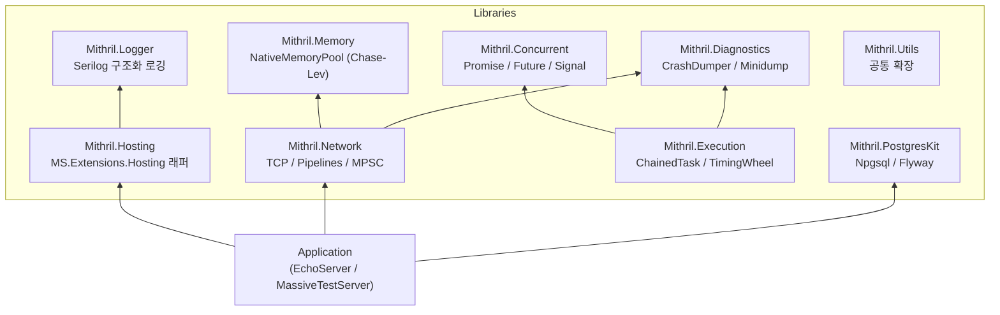

# Mithril.Engine

> **고성능 게임 서버 구축을 위한 C# 라이브러리 프레임워크**
> High-Performance Game Server Library Framework for C#

[](https://dotnet.microsoft.com/)
[](https://learn.microsoft.com/en-us/dotnet/)
[](https://learn.microsoft.com/en-us/dotnet/csharp/)
[](LICENSE)

---

## 소개

Mithril.Engine은 MMORPG 수준의 게임 서버를 구축하기 위한 **재사용 가능한 C# 라이브러리 모음**입니다.

단일 서버 애플리케이션이 아닌, 서버 개발의 각 레이어를 담당하는 독립 라이브러리들로 구성되어 있습니다. 각 라이브러리는 **Lock-Free 자료구조**, **Zero-Allocation I/O**, **Fail-Fast 장애 대응** 등의 원칙을 바탕으로 설계되었습니다.

> 이 프로젝트는 MMORPG 서버 개발 및 5년간의 라이브 서비스 운영 경험을 바탕으로, 직접 설계하고 구현한 개인 포트폴리오입니다.

---

## 핵심 기술 구현 (Technical Highlights)

### 1. NativeMemoryPool — Chase-Lev Work-Stealing Deque

GC 압력을 제거하기 위해 **비관리 메모리(Unmanaged Memory)를 직접 관리**하는 풀입니다.
단순한 `ArrayPool` 래핑이 아닌, Chase-Lev 알고리즘을 직접 구현하여 스레드 간 경합을 최소화했습니다.

**동작 방식:**

```
Thread 0 (owner)          Thread 1 (stealer)
────────────────          ──────────────────
Push → tail++ (CAS 없음)  Steal → head CAS 1회
Pop  → tail--  (CAS 0~1회)
```

- 각 스레드가 자신의 `WorkStealingDeque`를 독립적으로 소유
- Owner thread의 Push/Pop은 tail 포인터만 수정 → **CAS-free** (최악의 경우 CAS 1회)
- 다른 스레드의 steal은 head 포인터 CAS 1회
- 용량 초과 시 `NativeMemory.Free()`로 즉시 해제 → GC 힙 오염 없음

```csharp
// 사용 예시
using var buffer = nativeMemoryPool.Rent(1024);
Span<byte> span = buffer.AsSpan();
// ... 작업 후 using 블록 종료 시 자동 반환
```

---

### 2. ChainedTask — Lock-Free 직렬 실행 체인 (추후 추가 예정)

**특정 자원(ChainToken)에 대한 접근을 Lock 없이 직렬화**하는 실행 체인입니다.
`lock` / `SemaphoreSlim`의 스레드 블로킹 없이, 큐 기반으로 순서를 보장합니다.

**핵심 아이디어:**

```
Thread A: Task1 ──→ Chain(token) ──→ 즉시 실행
Thread B: Task2 ──→ Chain(token) ──→ Task1 완료 후 자동 트리거
Thread C: Task3 ──→ Chain(token) ──→ Task2 완료 후 자동 트리거
```

- `ChainToken.ownership`: CAS 기반 소유권 획득
- `ChainToken.tailTask`: 현재 체인의 마지막 작업 (ExchangeTailTask로 원자 교체)
- 새 작업은 이전 tail과 링크되어, 완료 시 자동으로 다음 작업을 트리거
- **단일 토큰** / **다중 토큰**(N개 자원을 동시에 잠금) 모두 지원

```csharp
// 단일 자원 직렬 접근
TaskBuilder.Build(async () =>
{
    // player 상태 안전하게 수정
}, playerToken);

// 다중 자원 동시 직렬 접근 (데드락 없음)
TaskBuilder.Build(async () =>
{
    // player + inventory 동시 안전 접근
}, new[] { playerToken, inventoryToken });
```

---

### 3. MpscByteBuffer — Lock-Free MPSC 송신 버퍼

다중 스레드에서 동시에 패킷을 송신할 때, **Lock 없이 안전한 큐잉을 보장**하는 버퍼입니다.

- **Push (다중 생산자)**: `Interlocked.CompareExchange`로 링크드 리스트 head 갱신
- **TryDrain (단일 소비자)**: `Interlocked.Exchange(ref head, null)`으로 전체 큐를 원자적으로 분리
- drain 후 LIFO → FIFO 반전 (링크드 리스트 reverse)
- `IValueTaskSource<bool>` 구현으로 **Zero-Allocation async 대기**

---

### 4. TimingWheel — O(1) 해시 타이머 (추후 추가 예정)

`System.Threading.Timer`의 힙 기반 삽입 O(log N) 대신, **O(1) 해시 버킷 삽입**을 제공하는 고성능 타이머입니다.

```
슬롯 수: 4096개 | 기본 tick 간격: 16.67ms (60Hz)

현재 tick → 슬롯 인덱스: tick & (4096 - 1)
큰 지연:    rounds 카운터로 바퀴 회전 수 관리
```

- 스케줄 등록: `ConcurrentQueue.Enqueue()` → O(1)
- 백그라운드 스레드가 tick마다 해당 슬롯의 콜백 실행
- `System.Threading.Timer` 객체 생성 비용 없음

---

### 5. System.IO.Pipelines 기반 Zero-Copy I/O

수신 처리는 `System.IO.Pipelines`를 통해 **커널 버퍼에서 직접 패킷을 파싱**합니다.

```
Socket ──→ Pipe.Writer (backpressure 자동 관리)
              │
              ▼
         Pipe.Reader ──→ PacketSerializer.TryParseHeader()
                              │ (SequenceReader, zero-copy)
                              ▼
                         IPacketDispatcher.Dispatch()
```

- `FillReceivePipeAsync` / `ProcessReceivePipeAsync` 독립 Task 분리
- `SequenceReader<byte>`로 scatter/gather 버퍼를 복사 없이 파싱
- 송신은 `NativeMemoryPool`에서 렌트한 버퍼를 `ReusableMemoryManager`로 `Memory<byte>` 변환 후 `SocketAsyncEventArgs`로 전송

---

### 6. Fail-Fast + Windows Minidump

장애 발생 시 **복구를 시도하지 않고 즉시 덤프 후 종료**합니다.
게임 서버 특성상, 잘못된 상태로 계속 실행하는 것보다 빠른 재시작이 낫다는 판단입니다.

```csharp
// 모든 Task/Chain 내 예외는 이 경로로 처리
CrashDumper.FailFastWithDump(exception, "session-pipeline");
// → {ProcessName}_{PID}_{timestamp}_session-pipeline.dmp 생성
// → .exception.txt, .meta.txt 사이드카 파일 생성
// → Environment.FailFast() 호출
```

---

## 아키텍처



---

## 라이브러리 구성

| 라이브러리              | 역할                    | 핵심 구현                                          |
| ----------------------- | ----------------------- | -------------------------------------------------- |
| **Mithril.Network**     | TCP 소켓 레이어         | `Session`, `MpscByteBuffer`, `SocketSender`        |
| **Mithril.Execution**   | 실행 흐름 제어          | `ChainedTask`, `TimingWheel`, `SerializableObject` |
| **Mithril.Concurrent**  | 비동기 동시성 기본 타입 | `Promise<T>`, `Future<T>`, `Signal`                |
| **Mithril.Memory**      | 네이티브 메모리 풀      | `NativeMemoryPool` (Chase-Lev Deque)               |
| **Mithril.Hosting**     | 서비스 수명 관리        | `Host<TConfigurator, TConfig>`                     |
| **Mithril.Logger**      | 구조화 로거             | `IAppLogger` (Serilog 기반)                        |
| **Mithril.Diagnostics** | 장애 분석               | `CrashDumper` (Windows Minidump)                   |
| **Mithril.PostgresKit** | PostgreSQL 접근 레이어  | `PostgresClient`, `FlywayMigrator`                 |
| **Mithril.Utils**       | 공통 유틸리티           | 확장 메서드 모음                                   |

---

## 벤치마크 (Benchmark)

> BenchmarkDotNet v0.14.0 · Windows 11 · .NET 10.0.6 · X64 RyuJIT AVX-512F  
> `Benchmarks/Mithril.Benchmarks/` 에서 직접 실행 가능.

```powershell
.\run-benchmark.ps1 -Target NativeMemoryPool
.\run-benchmark.ps1 -Target NativeMemoryPoolParallel
```

### NativeMemoryPool vs ArrayPool — 단일 스레드 Rent/Return

단일 스레드 단독 실행 기준. `ArrayPool.Shared`는 스레드 로컬 슬롯에서 배열 인덱스 하나만 조작하므로 경합이 없을 때 극도로 빠름. 반면 `NativeMemoryPool`은 Chase-Lev Deque의 tail 포인터를 volatile로 읽고 쓰는 비용이 있어 단순 비교에서 불리하게 나온다.

> 이 결과만 보면 NativeMemoryPool이 느린 것처럼 보이지만, 단일 스레드 단독 할당이 게임 서버의 실제 사용 패턴은 아니다. 패킷 수신·처리·송신이 서로 다른 스레드에서 동시에 버퍼를 요청하는 상황이 일반적이며, 그 시나리오가 아래 MPMC 벤치마크다.

| Method           | Size | Mean     | Ratio |
| ---------------- | ---- | -------- | ----- |
| ArrayPool        | 64 B | 5.09 ns  | 1.00  |
| NativeMemoryPool | 64 B | 10.15 ns | 2.00  |
| ArrayPool        | 1 KB | 5.41 ns  | 1.00  |
| NativeMemoryPool | 1 KB | 9.56 ns  | 1.77  |

### NativeMemoryPool vs ArrayPool — 병렬 MPMC (생산자/소비자 분리)

생산자 N개(Rent) + 소비자 N개(Return)를 별도 스레드에서 동시에 실행. `ArrayPool`은 내부적으로 `ConcurrentStack`을 공유하므로 스레드 수가 늘수록 CAS 충돌이 증가한다. `NativeMemoryPool`은 각 스레드가 독립 Deque를 소유하고 steal은 head CAS 1회뿐이므로 경합 구조가 다르다.

속도 자체는 고스레드에서 비슷하거나 소폭 느린 수준이지만, **힙 할당량은 모든 구간에서 일관되게 낮다.** NativeMemoryPool은 버퍼 데이터를 비관리 메모리에서 직접 할당하므로 GC 힙을 전혀 오염시키지 않는다 — 수천 클라이언트가 동시 접속한 상태에서 GC pause 없이 일정한 지연시간을 유지하는 것이 실질적인 목표다.

| Method                      | Threads | Mean        | Ratio    | Allocated |
| --------------------------- | ------- | ----------- | -------- | --------- |
| ArrayPool + ConcurrentQueue | 1       | 69.58 μs    | 1.00     | 6.62 KB   |
| NativeMemoryPool            | 1       | 40.40 μs    | **0.58** | 5.45 KB   |
| ArrayPool + ConcurrentQueue | 4       | 451.38 μs   | 1.00     | 17.05 KB  |
| NativeMemoryPool            | 4       | 475.54 μs   | 1.05     | 15.13 KB  |
| ArrayPool + ConcurrentQueue | 8       | 910.25 μs   | 1.00     | 12.93 KB  |
| NativeMemoryPool            | 8       | 954.09 μs   | 1.05     | 13.05 KB  |
| ArrayPool + ConcurrentQueue | 16      | 1,864.67 μs | 1.00     | 44.61 KB  |
| NativeMemoryPool            | 16      | 2,052.99 μs | 1.10     | 29.54 KB  |

---

## 빠른 시작 (Quick Start)

### EchoServer 구성 예시

```csharp
// 1. 서비스 설정 정의
public class EchoServerConfig : ServiceConfig
{
    public NetworkConfig Network { get; set; } = new();
}

// 2. DI 컨테이너 구성
public class EchoServerServiceBuilder : IServiceBuilder
{
    public void Build(HostBuilderContext context, IServiceCollection services)
    {
        var config = context.Configuration.Get<EchoServerConfig>();
        services.AddSingleton(config.Network);
        services.AddHostedService<EchoServerService>();
    }
}

// 3. 서비스 구현
public class EchoServerService : IHostedService
{
    public async Task StartAsync(CancellationToken ct)
    {
        var listener = networkFramework.CreateListener(networkConfig);
        await listener.StartAsync(new EchoDispatcher(), ct);
    }
}

// 4. 진입점
Host<EchoServerServiceBuilder, EchoServerConfig>.Run(args);
```

### 패킷 처리 흐름

```csharp
public class EchoDispatcher : IPacketDispatcher
{
    public void Dispatch(Session session, PacketId id, ReadOnlySequence<byte> payload)
    {
        // 수신 패킷을 그대로 송신 (Echo)
        var message = EchoRequest.Parser.ParseFrom(payload);
        session.Send(new EchoResponse { Message = message.Message });
    }
}
```

---

## 프로젝트 구조

```
/Libraries
  /Mithril.Network        # TCP 소켓 레이어
  /Mithril.Concurrent     # 비동기 동시성 기본 타입
  /Mithril.Execution      # ChainedTask, TimingWheel
  /Mithril.Hosting        # 서비스 호스팅
  /Mithril.Logger         # 구조화 로거 (Serilog)
  /Mithril.Memory         # 네이티브 메모리 풀
  /Mithril.Diagnostics    # CrashDumper (미니덤프)
  /Mithril.PostgresKit    # PostgreSQL 클라이언트
  /Mithril.Utils          # 공통 유틸리티

/Tools
  /Mithril.CodeGenerator  # .proto → C# 패킷 코드 생성

/Sample
  /Apps/EchoServer        # 에코 서버 예제
  /Apps/EchoClient        # 에코 클라이언트 예제
  /Apps/MassiveTestServer # 대량 연결 스트레스 테스트 서버
  /Apps/MassiveTestClient # 대량 연결 스트레스 테스트 클라이언트
  /AppServices/Echo       # 에코 서비스 구현체
  /Contents/Protocol      # .proto 파일 + 생성된 코드

/Benchmarks
  /Mithril.Benchmarks     # BenchmarkDotNet 성능 측정
```

---

## 설계 원칙

| 원칙                | 내용                                                                                 |
| ------------------- | ------------------------------------------------------------------------------------ |
| **Zero Allocation** | `Span<T>`, `ArrayPool<T>`, `NativeMemoryPool`으로 GC 힙 할당 최소화                  |
| **Lock-Free**       | `ChainedTask`, `MpscByteBuffer`, `NativeMemoryPool` 모두 lock 없이 동시성 보장       |
| **Fail-Fast**       | 복구 불가 예외 발생 시 미니덤프 생성 후 즉시 종료 (오염된 상태로 계속 실행 방지)     |
| **Backpressure**    | `System.IO.Pipelines`의 `PauseWriterThreshold`로 수신 과부하 자동 제어               |
| **DEBUG 전용 검증** | `AssertOnChain`, 200ms 초과 실행 경고는 DEBUG 빌드에서만 활성화 (릴리즈 경로 무영향) |

---

## 기술 스택

| 항목          | 기술                                    |
| ------------- | --------------------------------------- |
| Runtime       | .NET 10                                 |
| Language      | C# (nullable, unsafe)                   |
| Serialization | Google Protobuf 3.x                     |
| Networking    | System.IO.Pipelines, System.Net.Sockets |
| Database      | PostgreSQL (Npgsql + Flyway)            |
| Logging       | Serilog                                 |
| Hosting       | Microsoft.Extensions.Hosting            |
| Benchmark     | BenchmarkDotNet                         |

---

## Contact

|           |                       |
| --------- | --------------------- |
| **Email** | kor.mithril@gmail.com |

---

> 이 포트폴리오는 [Claude Code](https://claude.ai/code)와 함께 설계하고 구현했습니다.
